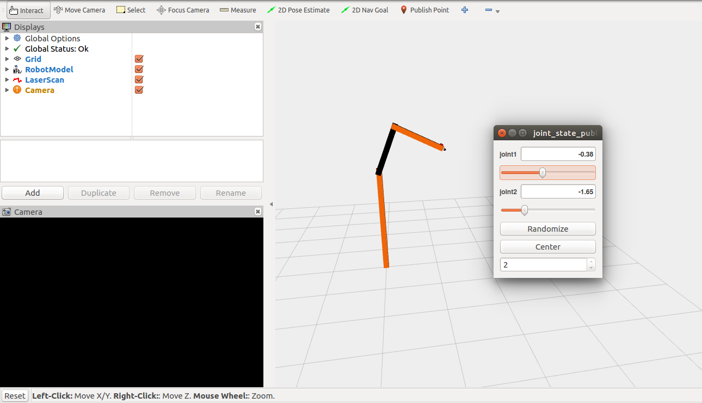
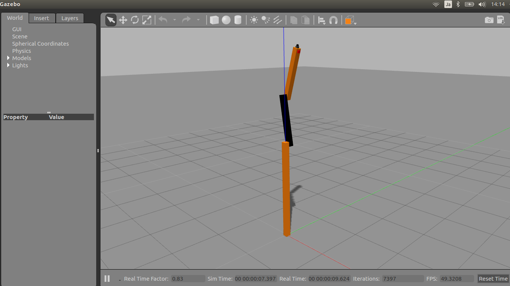

# Step 1: Using URDF in Gazebo

## Overview
#### Required
* An ```<inertia>``` element within each ```<link>``` element must be properly specified and configured.

#### Optional
* Add a ```<gazebo>``` element for every ```<link>```
    * Convert visual colors to Gazebo format
    * Convert stl files to dae files for better textures
    * Add sensor plugins
* Add a ```<gazebo>``` element for every ```<joint>```
    * Set proper damping dynamics
    * Add actuator control plugins
* Add a ```<gazebo>``` element for the ```<robot>``` element
* Add a ```<link name="world"/>``` link if the robot should be rigidly attached to the world/base_link

## Prerequisites

#### Getting RRBot
```
$ cd ~/catkin_ws/src/
$ git clone https://github.com/ros-simulation/gazebo_ros_demos.git
$ cd ..
$ catkin_make
```

#### View in Rviz
```
$ roslaunch rrbot_description rrbot_rviz.launch
```
 

If you do not get this, try killing all old roscore processes with ```$ killall roscore``` and relaunching RViz.

#### Examine the RRBot URDF
```
$ rosed rrbot_description rrbot.xacro
```
Note that we are using Xacro to make some of the link and joint calculations easier. 

* rrbot.gazebo a Gazebo specific file that includes most of our Gazebo-specific XML elements including the tags
* materials.xacro a simple Rviz colors file for storing rgba values, not really necessary but a nice convention

#### View in Gazebo
```
roslaunch rrbot_gazebo rrbot_world.launch
```
 


## Verifying the Gazebo Model Works
With Gazebo installed, an easy tool exists to check if your URDF can be properly converted into a SDF.
```
$ gz sdf -p rrbot.xml
```
This will show you the SDF that has been generated from your input URDF as well as any warnings about missing information required to generate the SDF.
