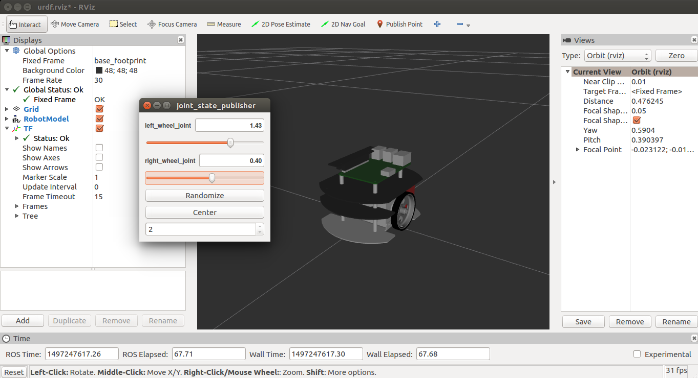
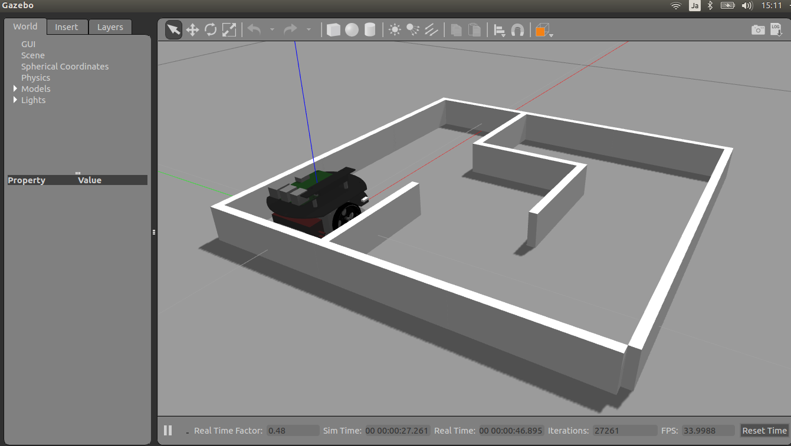

# Raspberry Pi Mouse Tutorial

## Environment
* Ubuntu 16.04 xenial
* ROS Kinetic

## Installation
```
$ sudo apt install python-catkin-tools
$ sudo apt install ros-kinetic-gazebo-ros-control ros-kinetic-ros-controllers
$ cd catkin_ws/src/
$ git clone http://github.com/ryuichiueda/raspimouse_ros.git
$ git clone https://github.com/rt-net/raspimouse_sim.git
$ cd ..
$ catkin build
```
## Testing Motion
* source the location of setup,sh
```
$ source ~/catkin_ws/devel/setup.sh
```
### RViz
```
$ roslaunch raspimouse_description display_urdf.launch
```
 

### Gazebo
```
$ roslaunch raspimouse_gazebo raspimouse_with_samplemaze.launch
```
 